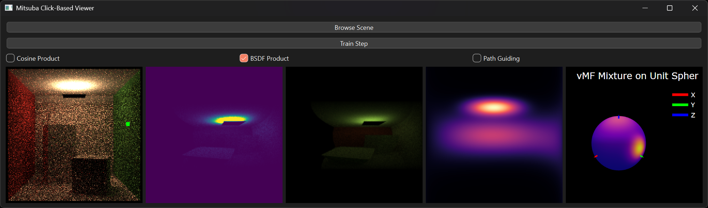

# py-neural-path-guiding

Neural Path Guiding Framework using Python providing flexible envronment for prototyping.
Also includes PyQt-based GUI tool for visualizing Mitsuba scene renders with click-inspection, spherical PDFs, and neural path guiding debug views.

---

### Have Implemented:
- `PathGuidingIntegrator`
- `SphericalSensor`
- vMF Mixture guiding (yet to validate)
- GUI Application for:
  - Visualization
  - Clicking to see the spherical PDF at a point
- Custom render loop for frame-by-frame rendering

---

### Yet To Do:
- IMPROVE SPEED (Priority)
- ALIGN VISUALIZATIONS (Priority)
- Make more information available on the UI and allow more control over hyperparameters
- Implement more guiding techniques

---

### Notes
This is a research-focused prototype. While not optimized for production performance, it offers a flexible environment for experimenting with neural path guiding in Mitsuba 3 using Python.

---

### Contributions
Suggestions, feedback, and contributions are welcome.
