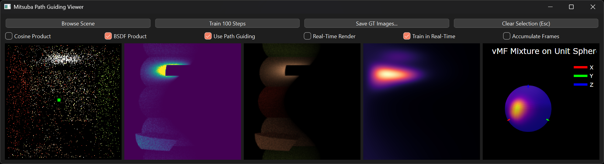

# py-neural-path-guiding

A modular Neural Path Guiding framework for Mitsuba 3, implemented in Python.  
This project provides a flexible environment for prototyping modern path-guiding techniques, neural importance sampling methods, and directional distribution models.  
It also includes a PyQt-based GUI viewer for inspecting Mitsuba scene renders, visualizing spherical PDFs, and debugging guiding behavior.

---

## Features Implemented

### Rendering and Visualization
- PyQt viewer for interactive Mitsuba 3 scene inspection
- Click-to-inspect spherical PDF visualization
- Debug views for guiding structures and neural models

### Path Guiding Implemented
- Distribution Factorization
- Neural Importance Sampling
- vMF Mixture Model

---

## Project Structure

The repository is organized into the following key modules:

- `guiding/` — Path guiding algorithms and integrators
- `distributions/` — Spatial and directional density models, including vMF mixtures
- `networks/` — Neural network components for sampling and radiance estimation
- `ui/` — PyQt-based visualization and inspection tools
- `rendering/` — Mitsuba integration utilities and rendering helpers
- `utils/` — Common math, logging, and support utilities

This modular structure enables easy experimentation and replacement of guiding methods, distributions, and neural models.

---

## Notes

This repository is a research-focused prototype.  
It is designed for clarity and flexibility rather than production performance.  
Useful for experimenting with neural path guiding, importance sampling, and radiance learning inside Mitsuba 3.

---

## Roadmap

Planned or in-progress work includes:

- Add new guiding methods (WIP)
- Expanded Neural Radiance Cache pipeline (WIP)
- Improved visualization and debugging tools (added training data visualization)
- Example scripts and notebooks for experiments
- Speed Improvments (Implement using new Drjit Neural Networks)

---

## Contributions

Contributions, suggestions, and feedback are welcome.  
Feel free to open issues or submit pull requests.
